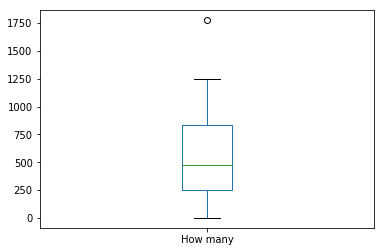

# MT5: Visualização de dados de amigos do facebook através de boxplot 


```python
%matplotlib inline
import matplotlib.pyplot as plt
import pandas as pd
df = pd.read_csv('FacebookFrends.csv');

df.head()
```


<div>
<style scoped>
    .dataframe tbody tr th:only-of-type {
        vertical-align: middle;
    }

    .dataframe tbody tr th {
        vertical-align: top;
    }

    .dataframe thead th {
        text-align: right;
    }
</style>
<table border="1" class="dataframe">
  <thead>
    <tr style="text-align: right;">
      <th></th>
      <th>Timestamp</th>
      <th>How many</th>
    </tr>
  </thead>
  <tbody>
    <tr>
      <th>0</th>
      <td>02/01/2013 16:59:06</td>
      <td>0</td>
    </tr>
    <tr>
      <th>1</th>
      <td>02/01/2013 15:20:50</td>
      <td>69</td>
    </tr>
    <tr>
      <th>2</th>
      <td>02/01/2013 16:16:51</td>
      <td>123</td>
    </tr>
    <tr>
      <th>3</th>
      <td>02/01/2013 18:14:04</td>
      <td>137</td>
    </tr>
    <tr>
      <th>4</th>
      <td>02/01/2013 20:04:27</td>
      <td>174</td>
    </tr>
  </tbody>
</table>
</div>


```python
df.plot.box()
```


    <matplotlib.axes._subplots.AxesSubplot at 0x7f8fa9f03710>





```python

```
