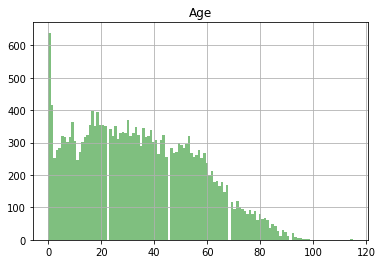
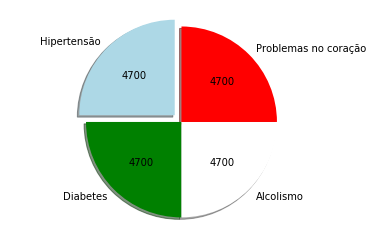

# Investigação de dados

## DataSet: _Não comparecimento as consultas médicas_

Esta base de dados possui informações de 100.000 consultas médicas no Brasil e está focado na questão de buscar compreender se o paciente irá ou não comparecer a consulta. As características sobre os pacientes são descritas em cada linha.

<li>**ScheduledDay:** informa o dia em que o paciente marcou sua consulta.
<li>**Neighborhood:** indica a localização do hospital.
<li>**Scholarship:** indica se o paciente está ou não envolvido com o programa Bolsa Família.
Tenha cuidado ao interpretar a última coluna. **'No'** significa que o paciente compareceu a consulta previamente agendada. Por outro lado, **'Yes'** signifca que ele não compareceu.

## Table of Contents

<ul>
<li><a href="#intro">Introduction</a></li>
<li><a href="#wrangling">Data Wrangling</a></li>
<li><a href="#eda">Exploratory Data Analysis</a></li>
<li><a href="#conclusions">Conclusions</a></li>
</ul>

## Perguntas

**1)** Quem mais falta as consultas homens ou mulheres?<br>
**2)** Qual a proporção de pacientes que não comparecem às consultas?<br>
**3)** Qual a distribuição da idade de pacientes que não comparecem às consultas?<br>
**4)** Há alguma relação entre doença e não comparecimento às consultas?<br>
**5)** Qual a cidade com maior número de não comparecimentos?<br>
**6)** Qual é o mês, dia da semana e dia do mês com maior número de não comparecimentos?<br>
**7)** Há alguma correlação entre a participação no programa social Bolsa Família e os comparecimentos?

## Carregar os dados:


```python
%matplotlib inline
import matplotlib.pyplot as plt
import pandas as pd
import numpy as np
import datetime
#dtype={'AppointmentDay': str}
df = pd.read_csv('noshowappointments-kagglev2-may-2016.csv');

df.head()
#df.dtypes
```


<div>
<style scoped>
    .dataframe tbody tr th:only-of-type {
        vertical-align: middle;
    }

    .dataframe tbody tr th {
        vertical-align: top;
    }

    .dataframe thead th {
        text-align: right;
    }
</style>
<table border="1" class="dataframe">
  <thead>
    <tr style="text-align: right;">
      <th></th>
      <th>PatientId</th>
      <th>AppointmentID</th>
      <th>Gender</th>
      <th>ScheduledDay</th>
      <th>AppointmentDay</th>
      <th>Age</th>
      <th>Neighbourhood</th>
      <th>Scholarship</th>
      <th>Hipertension</th>
      <th>Diabetes</th>
      <th>Alcoholism</th>
      <th>Handcap</th>
      <th>SMS_received</th>
      <th>No-show</th>
    </tr>
  </thead>
  <tbody>
    <tr>
      <th>0</th>
      <td>2.987250e+13</td>
      <td>5642903</td>
      <td>F</td>
      <td>2016-04-29T18:38:08Z</td>
      <td>2016-04-29T00:00:00Z</td>
      <td>62</td>
      <td>JARDIM DA PENHA</td>
      <td>0</td>
      <td>1</td>
      <td>0</td>
      <td>0</td>
      <td>0</td>
      <td>0</td>
      <td>No</td>
    </tr>
    <tr>
      <th>1</th>
      <td>5.589978e+14</td>
      <td>5642503</td>
      <td>M</td>
      <td>2016-04-29T16:08:27Z</td>
      <td>2016-04-29T00:00:00Z</td>
      <td>56</td>
      <td>JARDIM DA PENHA</td>
      <td>0</td>
      <td>0</td>
      <td>0</td>
      <td>0</td>
      <td>0</td>
      <td>0</td>
      <td>No</td>
    </tr>
    <tr>
      <th>2</th>
      <td>4.262962e+12</td>
      <td>5642549</td>
      <td>F</td>
      <td>2016-04-29T16:19:04Z</td>
      <td>2016-04-29T00:00:00Z</td>
      <td>62</td>
      <td>MATA DA PRAIA</td>
      <td>0</td>
      <td>0</td>
      <td>0</td>
      <td>0</td>
      <td>0</td>
      <td>0</td>
      <td>No</td>
    </tr>
    <tr>
      <th>3</th>
      <td>8.679512e+11</td>
      <td>5642828</td>
      <td>F</td>
      <td>2016-04-29T17:29:31Z</td>
      <td>2016-04-29T00:00:00Z</td>
      <td>8</td>
      <td>PONTAL DE CAMBURI</td>
      <td>0</td>
      <td>0</td>
      <td>0</td>
      <td>0</td>
      <td>0</td>
      <td>0</td>
      <td>No</td>
    </tr>
    <tr>
      <th>4</th>
      <td>8.841186e+12</td>
      <td>5642494</td>
      <td>F</td>
      <td>2016-04-29T16:07:23Z</td>
      <td>2016-04-29T00:00:00Z</td>
      <td>56</td>
      <td>JARDIM DA PENHA</td>
      <td>0</td>
      <td>1</td>
      <td>1</td>
      <td>0</td>
      <td>0</td>
      <td>0</td>
      <td>No</td>
    </tr>
  </tbody>
</table>
</div>


# **1)** Quem mais falta as consultas homens ou mulheres?


```python
df.groupby(["Gender", "No-show"]).size()


```


    Gender  No-show
    F       No         57246
            Yes        14594
    M       No         30962
            Yes         7725
    dtype: int64


Conclusão: Com um total de 14.594(mulheres) e 7725(homens) podemos afirmar que as mulheres faltam mais que os homens ás consultas médicas. 


# **2.** Qual a proporção de pacientes que não comparecem às consultas? 


Levando em consideração a questão anterior, temos que 14.594 mulheres faltaram as consultas 
e  7725 homens  que  também faltaram, o que corresponde 22319 faltas as consultas,  o todo 
de quantidade de consultas é corresponde á 110527, dividindo o numero de consultas agendadas pelo numero de consultas faltadas, temos a proporção de 110527/22319, aplicando um simples regra de 3, onde 110527 corresponde ao todo (100%), e 22319  um numero que não conhecemos, temos que 22319 corresponde a cerca 20% das consultas,ou seja, proporcional a 0.20 das consultas marcadas foram faltadas. 


# 3.Qual a distribuição da idade de pacientes que não comparecem às consultas?

Vamos criar um novo dataframe para trabalhar somente com os dados relativos a pacientes 
que não compareceram as consultas 


```python
distribuicao = df[df['No-show'] == 'Yes']


```

Feito isso, podemos cruzar os dados de faltas com as idades, dessa forma teremos uma mostragem de dados que poderá auxiliar na elaboração do gráfico: 


```python
pd.crosstab(distribuicao['No-show'],distribuicao['Age'])


```


<div>
<style scoped>
    .dataframe tbody tr th:only-of-type {
        vertical-align: middle;
    }

    .dataframe tbody tr th {
        vertical-align: top;
    }

    .dataframe thead th {
        text-align: right;
    }
</style>
<table border="1" class="dataframe">
  <thead>
    <tr style="text-align: right;">
      <th>Age</th>
      <th>0</th>
      <th>1</th>
      <th>2</th>
      <th>3</th>
      <th>4</th>
      <th>5</th>
      <th>6</th>
      <th>7</th>
      <th>8</th>
      <th>9</th>
      <th>...</th>
      <th>90</th>
      <th>91</th>
      <th>92</th>
      <th>93</th>
      <th>94</th>
      <th>95</th>
      <th>96</th>
      <th>97</th>
      <th>98</th>
      <th>115</th>
    </tr>
    <tr>
      <th>No-show</th>
      <th></th>
      <th></th>
      <th></th>
      <th></th>
      <th></th>
      <th></th>
      <th></th>
      <th></th>
      <th></th>
      <th></th>
      <th></th>
      <th></th>
      <th></th>
      <th></th>
      <th></th>
      <th></th>
      <th></th>
      <th></th>
      <th></th>
      <th></th>
      <th></th>
    </tr>
  </thead>
  <tbody>
    <tr>
      <th>Yes</th>
      <td>639</td>
      <td>415</td>
      <td>252</td>
      <td>277</td>
      <td>282</td>
      <td>320</td>
      <td>316</td>
      <td>301</td>
      <td>318</td>
      <td>364</td>
      <td>...</td>
      <td>23</td>
      <td>13</td>
      <td>20</td>
      <td>10</td>
      <td>6</td>
      <td>6</td>
      <td>1</td>
      <td>2</td>
      <td>1</td>
      <td>3</td>
    </tr>
  </tbody>
</table>
<p>1 rows × 100 columns</p>
</div>


Elaboramos o grafico referente para melhor vizualização dos dados


```python
distribuicao[['No-show','Age']].hist(bins=120,alpha=0.5,color='Green')

```


    array([[<matplotlib.axes._subplots.AxesSubplot object at 0x7f9decf12898>]],
          dtype=object)





Conclusão: Podemos perceber, que o maior numero de faltas concentram-se na idade entre 0 e 1 ano de idade 

# **4)** Há alguma relação entre doença e não comparecimento às consultas?

Podemos agrupar os dados levando em consideração as doenças e as faltas, o 1 representa que existe determinada doença, e o 0 é que não, primeiro agruparemos as pessoas que tenham pelos menos uma das doenças definidas na base de dados:


```python
naocomparecimento= distribuicao[ (distribuicao['Hipertension'] == 1) | (distribuicao['Diabetes'] == 1) | (distribuicao['Alcoholism'] == 1) | (distribuicao['Handcap'] == 1) ]


    
    
```

Em seguida, contamos a quantidade de vezes que as doenças são detectada nas consultas não realizadas 


```python
hipertensao= naocomparecimento['Hipertension'].count() 
diabetes= naocomparecimento['Diabetes'].count()
alcolismo=  naocomparecimento['Alcoholism'].count()
problemacoracao= naocomparecimento['Handcap'].count() 
      

   

```

Depois, elaboramos um gráfico parar a melhor visualização dos dados referente ás doenças 


```python
labels = ['Hipertensão', 'Diabetes', 'Alcolismo', 'Problemas no coração']
titulos = [hipertensao, diabetes,alcolismo,problemacoracao]
cores = ['lightblue', 'green', 'white', 'red']
explode = (0.1, 0, 0, 0)  
total = (hipertensao+diabetes+alcolismo+problemacoracao) 

plt.pie(titulos, explode=explode, labels=labels, colors=cores, autopct=lambda p: '{:.0f}'.format(p * total / 100), shadow=True, startangle=90)

plt.axis('equal') 
plt.show()
```





Conclusão:Podemos perceber, que o numero de faltas por tipo de doença é homogenia, isso pode levar a crer, que os pacientes avaliados podem conter  2 doenças relacionadas entre sí, o que pode acarretar no não comparecimento ás consultas.

# **5)** Qual a cidade com maior número de não comparecimentos?<br>


```python
distribuicao['Neighbourhood'].unique()

#distribuicao['Neighbourhood'].values_counts(normalize=True)
pd.value_counts(distribuicao['Neighbourhood'].values.flatten())
```


    JARDIM CAMBURI                 1465
    MARIA ORTIZ                    1219
    ITARARÉ                         923
    RESISTÊNCIA                     906
    CENTRO                          703
    JESUS DE NAZARETH               696
    JARDIM DA PENHA                 631
    CARATOÍRA                       591
    TABUAZEIRO                      573
    BONFIM                          550
    ILHA DO PRÍNCIPE                532
    ANDORINHAS                      521
    SÃO PEDRO                       515
    SANTO ANDRÉ                     508
    SANTA MARTHA                    496
    SANTO ANTÔNIO                   484
    ROMÃO                           474
    GURIGICA                        456
    JABOUR                          451
    DA PENHA                        429
    SÃO JOSÉ                        428
    MARUÍPE                         424
    NOVA PALESTINA                  402
    BELA VISTA                      384
    SANTOS DUMONT                   369
    SÃO CRISTÓVÃO                   363
    ILHA DE SANTA MARIA             361
    FORTE SÃO JOÃO                  346
    CRUZAMENTO                      304
    PRAIA DO SUÁ                    294
                                   ... 
    SANTA CECÍLIA                   123
    SANTOS REIS                     112
    MATA DA PRAIA                   110
    ESTRELINHA                      106
    DO MOSCOSO                       92
    BARRO VERMELHO                   91
    PIEDADE                          88
    DO CABRAL                        88
    SANTA LÚCIA                      86
    SANTA LUÍZA                      77
    SOLON BORGES                     69
    ARIOVALDO FAVALESSA              62
    BOA VISTA                        58
    COMDUSA                          56
    MÁRIO CYPRESTE                   54
    ENSEADA DO SUÁ                   52
    ANTÔNIO HONÓRIO                  50
    FRADINHOS                        48
    DE LOURDES                       47
    HORTO                            42
    SANTA HELENA                     37
    UNIVERSITÁRIO                    32
    NAZARETH                         29
    SEGURANÇA DO LAR                 28
    MORADA DE CAMBURI                16
    PONTAL DE CAMBURI                12
    ILHA DO BOI                       3
    ILHA DO FRADE                     2
    ILHAS OCEÂNICAS DE TRINDADE       2
    AEROPORTO                         1
    Length: 80, dtype: int64


Como podemos ver, o hospital com maior numero de não comparecimentos é o das proximidades do  JARDIM CAMBURI com 1465 não comparecimentos, o JARDIM CAMBURI, está localizado na cidade de Vitória-ES


```python

```

# **6)** Qual é o mês, dia da semana e dia do mês com maior número de não comparecimentos?


```python
Primeiro, iremos transformar a coluna AppointmentDay para o tipo datetime  
```


```python


distribuicao['AppointmentDay']=pd.to_datetime(distribuicao.AppointmentDay)


```

    /usr/local/lib/python3.6/dist-packages/ipykernel_launcher.py:3: SettingWithCopyWarning: 
    A value is trying to be set on a copy of a slice from a DataFrame.
    Try using .loc[row_indexer,col_indexer] = value instead
    
    See the caveats in the documentation: http://pandas.pydata.org/pandas-docs/stable/indexing.html#indexing-view-versus-copy
      This is separate from the ipykernel package so we can avoid doing imports until


```python
Agora, agrupamos o numero de consultas por mês
```


```python
df.groupby(distribuicao['AppointmentDay'].dt.month).size()

```


    AppointmentDay
    4.0      633
    5.0    16804
    6.0     4882
    dtype: int64


```python
Como podemos perceber, o mês 5(MAIO) é o que dispoẽ de maior quantidade de tuplas agrupadas, 
ou seja, ele é o mês com maior numero de faltas. Em seguida, agrupamos os dias do mês 5 
para podemos obter os dados de faltas por dia da semana
```


```python
dias = distribuicao[distribuicao.AppointmentDay.dt.month==5]
pd.value_counts(dias.AppointmentDay.dt.dayofweek.values.flatten())


```


    1    4336
    0    3817
    2    3507
    4    2599
    3    2536
    5       9
    dtype: int64


```python
Como podemos observar, o dia da semana  que ocorre maior numero de faltas, é a terça-feira
com 4336 faltas
```


```python
pd.value_counts(dias.AppointmentDay.dt.day.values.flatten())

```


    16    1049
    9     1019
    10     992
    4      973
    17     935
    13     905
    20     899
    19     892
    18     890
    30     888
    11     885
    2      861
    12     837
    3      831
    24     811
    5      807
    6      795
    31     767
    25     759
    14       9
    dtype: int64


Podemos observar,que no dia 16 é o dia que ocorre o maior numero de faltas, com 1049 faltas ocorridas no dia.

# **7)** Há alguma correlação entre a participação no programa social Bolsa Família e os comparecimentos?


```python
df.groupby(["Scholarship", "No-show"]).size()


```


    Scholarship  No-show
    0            No         79925
                 Yes        19741
    1            No          8283
                 Yes         2578
    dtype: int64


```python
Conclusão: Os participantes do Bolsa Famíla correspondem a 10861, os mesmo em sua grande 
maioria, no total de 8283 não faltam as consultas, o que correspondem a 76% das consultas
realizadas com os participantes do programa.

```
