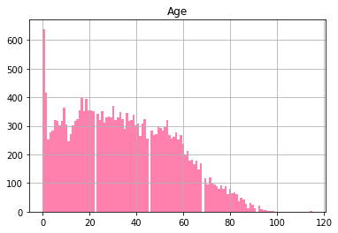

# Investigação de dados

## DataSet: _Não comparecimento as consultas médicas_

Esta base de dados possui informações de 100.000 consultas médicas no Brasil e está focado na questão de buscar compreender se o paciente irá ou não comparecer a consulta. As características sobre os pacientes são descritas em cada linha.

<li>**ScheduledDay:** informa o dia em que o paciente marcou sua consulta.
<li>**Neighborhood:** indica a localização do hospital.
<li>**Scholarship:** indica se o paciente está ou não envolvido com o programa Bolsa Família.
Tenha cuidado ao interpretar a última coluna. **'No'** significa que o paciente compareceu a consulta previamente agendada. Por outro lado, **'Yes'** signifca que ele não compareceu.

## Table of Contents

<ul>
<li><a href="#intro">Introduction</a></li>
<li><a href="#wrangling">Data Wrangling</a></li>
<li><a href="#eda">Exploratory Data Analysis</a></li>
<li><a href="#conclusions">Conclusions</a></li>
</ul>

## Perguntas

**1)** Quem mais falta as consultas homens ou mulheres?<br>
**2)** Qual a proporção de pacientes que não comparecem às consultas?<br>
**3)** Qual a distribuição da idade de pacientes que não comparecem às consultas?<br>
**4)** Há alguma relação entre doença e não comparecimento às consultas?<br>
**5)** Qual a cidade com maior número de não comparecimentos?<br>
**6)** Qual é o mês, dia da semana e dia do mês com maior número de não comparecimentos?<br>
**7)** Há alguma correlação entre a participação no programa social Bolsa Família e os comparecimentos?

## Carregar os dados:


```python
%matplotlib inline
import matplotlib.pyplot as plt
import pandas as pd
import numpy as np
import datetime
df = pd.read_csv('noshowappointments-kagglev2-may-2016.csv');


```

# **1)** Quem mais falta as consultas homens ou mulheres?


```python
df.groupby(["Gender", "No-show"]).size()


```


    Gender  No-show
    F       No         57246
            Yes        14594
    M       No         30962
            Yes         7725
    dtype: int64


Conclusão: Com um total de 14.594(mulheres) e 7725(homens) podemos afirmar que as mulheres faltam mais que os homens ás consultas médicas. 


# **2.** Qual a proporção de pacientes que não comparecem às consultas? 


```python
df.groupby('No-show')['AppointmentID'].nunique().plot(kind='bar')


```


    <matplotlib.axes._subplots.AxesSubplot at 0x7effe07d4610>


# 3.Qual a distribuição da idade de pacientes que não comparecem às consultas?


```python
distribuicao = df[df['No-show'] == 'Yes']


```


```python
distribuicao[['No-show','Age']].hist(bins=120,alpha=0.5,color='#FF005E')
plt.savefig('nomeDaFigura.png')    

```





Conclusão: Podemos perceber, que o maior numero de faltas concentram-se em bebês, em seus primeiros meses de vida.

# **4)** Há alguma relação entre doença e não comparecimento às consultas?


```python
hipertensos = df.loc[df['Hipertension'] == 1, ['No-show', 'Hipertension']]
hipertensosCont = hipertensos.loc[hipertensos['No-show'] == 'Yes', ['Hipertension']].count()

diabetes = df.loc[df['Diabetes'] == 1, ['No-show', 'Diabetes']]
diabetesCont = diabetes.loc[diabetes['No-show'] == 'Yes', ['Diabetes']].count()
alcoolismo = df.loc[df['Alcoholism'] == 1, ['No-show', 'Alcoholism']]
alcoolismoCont= alcoolismo.loc[alcoolismo['No-show'] == 'Yes', ['Alcoholism']].count()

```


```python
labels = ['Hipertensos', 'Diabetes', 'Alcoolismo']
sizes = [hipertensosCont,diabetesCont , alcoolismoCont]
fig1,ax1= plt.subplots()
ax1.pie(sizes,labels=labels, autopct='%1.1f%%', shadow=True, startangle=90)
ax1.axis('equal') 
plt.show()
plt.savefig('pizza.png')    


   

```


    <matplotlib.figure.Figure at 0x7effdfb66050>


Conclusão:Podemos perceber, que aparentemente os hipertensos são mais propensos a faltar ás consultas

# **5)** Qual a cidade com maior número de não comparecimentos?<br>


```python
cidade= distribuicao.groupby('Neighbourhood').size()
cidade = df.groupby('Neighbourhood').size().reset_index(name='Cidade')
cidade.loc[cidade['Cidade'].idxmax()]

```


    Neighbourhood    JARDIM CAMBURI
    Cidade                     7717
    Name: 38, dtype: object


Como podemos ver, o hospital com maior numero de não comparecimentos é o das proximidades do  JARDIM CAMBURI com 1465 não comparecimentos, o JARDIM CAMBURI, está localizado na cidade de Vitória-ES

# **6)** Qual é o mês, dia da semana e dia do mês com maior número de não comparecimentos?


```python

distribuicao['AppointmentDay']=pd.to_datetime(distribuicao.AppointmentDay)


```

    /home/vectro26/.local/lib/python2.7/site-packages/ipykernel_launcher.py:2: SettingWithCopyWarning: 
    A value is trying to be set on a copy of a slice from a DataFrame.
    Try using .loc[row_indexer,col_indexer] = value instead
    
    See the caveats in the documentation: http://pandas.pydata.org/pandas-docs/stable/indexing.html#indexing-view-versus-copy
      


Agora, agrupamos o numero de consultas por mês


```python
df.groupby(distribuicao['AppointmentDay'].dt.month).size()

```


    AppointmentDay
    4.0      633
    5.0    16804
    6.0     4882
    dtype: int64


Como podemos perceber, o mês 5(MAIO) é o que dispoẽ de maior quantidade de tuplas agrupadas, 
ou seja, ele é o mês com maior numero de faltas. Em seguida, agrupamos os dias do mês 5 
para podemos obter os dados de faltas por dia da semana


```python
df.groupby(distribuicao['AppointmentDay'].dt.dayofweek).size()


```


    AppointmentDay
    0.0    4690
    1.0    5152
    2.0    5093
    3.0    3338
    4.0    4037
    5.0       9
    dtype: int64


Como podemos observar, o dia da semana  que ocorre maior numero de faltas, é a terça-feira
com 5123 faltas


```python
pd.value_counts(dias.AppointmentDay.dt.day.values.flatten())

```


    16    1049
    9     1019
    10     992
    4      973
    17     935
    13     905
    20     899
    19     892
    18     890
    30     888
    11     885
    2      861
    12     837
    3      831
    24     811
    5      807
    6      795
    31     767
    25     759
    14       9
    dtype: int64


Podemos observar,que no dia 16 é o dia que ocorre o maior numero de faltas, com 1049 faltas ocorridas no dia.

# **7)** Há alguma correlação entre a participação no programa social Bolsa Família e os comparecimentos?


```python
df.groupby(["Scholarship", "No-show"]).size()


```


    Scholarship  No-show
    0            No         79925
                 Yes        19741
    1            No          8283
                 Yes         2578
    dtype: int64


```python
df.groupby(["Scholarship", "No-show"]).size().plot(kind='bar')

```


    <matplotlib.axes._subplots.AxesSubplot at 0x7effddd8e1d0>


Conclusão: Os participantes do Bolsa Famíla correspondem a 10861, os mesmos em sua grande  maioria, no total de 8283 não faltam as consultas, o que correspondem a 76% das consultas realizadas com os participantes do programa. Ao analisar os dados, podemos perceber que é menos proprício participantes do bolsa família faltar aos atendimentos médicos.


# Conclusão geral 

Com base  no estudo realizado, podemos perceber que existe um Outlier na distribuição de idades dos pacientes, especificamente  nos primeiros de vida de um bebê, uma das hipóteses que pode ser levantadas é que existe essa ausência nas consultas, devido  o programa Estratégia Saúde Familiar(ESF), esse programa acompanha crianças e idosos, com isso não é necessário a ida até a unidade de saúde para realizar a consulta médica.
