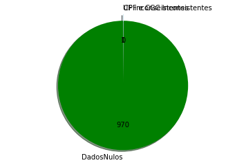

# Lei Rouanet

Principal mecanismo de fomento à Cultura do Brasil, a [Lei Rouanet](http://dados.gov.br/dataset/incentivos-da-lei-rouanet), como é conhecida a Lei 8.313/91, instituiu o Programa Nacional de Apoio à Cultura (Pronac). O nome Rouanet remete a seu criador, o então secretário Nacional de Cultura, o diplomata Sérgio Paulo Rouanet. Para cumprir este objetivo, a lei estabelece as normativas de como o Governo Federal deve disponibilizar recursos para a realização de projetos artístico-culturais. A Lei foi concebida originalmente com três mecanismos: o Fundo Nacional da Cultura (FNC), o Incentivo Fiscal e o Fundo de Investimento Cultural e Artístico (Ficart). Este nunca foi implementado, enquanto o Incentivo Fiscal - também chamado de mecenato - prevaleceu e chega ser confundido com a própria Lei.

Mais informações sobre a Lei Rouanet podem ser obtidos em seu portal: http://rouanet.cultura.gov.br/

 ## É-lhe pedido:

* 0) Obtenha os dados da [Lei Rouanet](http://dados.gov.br/dataset/incentivos-da-lei-rouanet) e organize-os em um banco de dados relacional ou diretamente na sua linguaguem de programação.
* 1) Apresente os tipos de todas as variáveis e seus índices de tendência central quando for possível.
* 2) Analise a poluição dos dados. Há dados nulos, vazios, problemáticos? Quantos? Quais? Como resolver? (Aproveite e resolva)
* 3) Apresente ao menos uma forma de medir a similaridade entre projetos aprovados e outra para projetos não aprovados.
* 4) Qual o projeto recebeu o maior investimento?
* 5) Qual empresa investiu mais na Lei Rouanet ao longo do tempo?
* 6) Qual foi a empresa mais beneficiada ao longo do tempo?
* 7) Há algum solicitante que sempre ganha?
* 8) Consegue associar algum CNPJ a algum artista conhecido?
* 9) Apresente suas conclusões e hipóteses para o futuro baseado nos fatos encontrados.

# 0) Obtenha os dados da Lei Rouanet e organize-os em um banco de dados relacional ou diretamente na sua linguaguem de programação.

# Carregar dados 


```python
%matplotlib inline
import matplotlib.pyplot as plt
import pandas as pd
import numpy as np
proposta = pd.read_csv('salicapi-propostas-b7d218c49fac0a1020948bb1230aabfc.csv');
incentivadores= pd.read_csv('salicapi-incentivadores-b7d218c49fac0a1020948bb1230aabfc.csv');
projetos= pd.read_csv('salicapi-projetos-b7d218c49fac0a1020948bb1230aabfc.csv');
proponentes= pd.read_csv('salicapi-proponentes-b7d218c49fac0a1020948bb1230aabfc.csv');
segmentos= pd.read_csv('salicapi-segmentos-b7d218c49fac0a1020948bb1230aabfc.csv');
areas=  pd.read_csv('salicapi-areas-b7d218c49fac0a1020948bb1230aabfc.csv');
fornecedores= pd.read_csv('salicapi-fornecedores-b7d218c49fac0a1020948bb1230aabfc.csv')

```

# 1) Apresente os tipos de todas as variáveis e seus índices de tendência central quando for possível.

# *Variaveis do dataframe  propostas 


```python
proposta.dtypes
```


    data_arquivamento         object
    acessibilidade            object
    impacto_ambiental         object
    nome                      object
    democratizacao            object
    justificativa             object
    mecanismo                 object
    resumo                    object
    sinopse                   object
    especificacao_tecnica     object
    data_inicio               object
    objetivos                 object
    ficha_tecnica             object
    etapa                     object
    data_aceite              float64
    id                         int64
    estrategia_execucao       object
    data_termino              object
    dtype: object


# Tipos de variaveis do dataframe Proposta 

# Qualitativas nominais

acessibilidade,impacto_ambiental,nome,democratizacao,justificativa,mecanismo,resumo,sinopse,especificacao_tecnica,etapa,estrategia_execucao.

# Qualitativas ordinais 

data_arquivamento,data_aceite,data_termino

# Quantitativas discretas

id

# Índice de Tendência central do dataframe Proposta 


```python
proposta.describe()
```


<div>
<style scoped>
    .dataframe tbody tr th:only-of-type {
        vertical-align: middle;
    }

    .dataframe tbody tr th {
        vertical-align: top;
    }

    .dataframe thead th {
        text-align: right;
    }
</style>
<table border="1" class="dataframe">
  <thead>
    <tr style="text-align: right;">
      <th></th>
      <th>data_aceite</th>
      <th>id</th>
    </tr>
  </thead>
  <tbody>
    <tr>
      <th>count</th>
      <td>0.0</td>
      <td>100.000000</td>
    </tr>
    <tr>
      <th>mean</th>
      <td>NaN</td>
      <td>50.500000</td>
    </tr>
    <tr>
      <th>std</th>
      <td>NaN</td>
      <td>29.011492</td>
    </tr>
    <tr>
      <th>min</th>
      <td>NaN</td>
      <td>1.000000</td>
    </tr>
    <tr>
      <th>25%</th>
      <td>NaN</td>
      <td>25.750000</td>
    </tr>
    <tr>
      <th>50%</th>
      <td>NaN</td>
      <td>50.500000</td>
    </tr>
    <tr>
      <th>75%</th>
      <td>NaN</td>
      <td>75.250000</td>
    </tr>
    <tr>
      <th>max</th>
      <td>NaN</td>
      <td>100.000000</td>
    </tr>
  </tbody>
</table>
</div>


# *Variaveis do dataframe  Incentivadores


```python
incentivadores.dtypes
```


    nome            object
    cgccpf          object
    total_doado    float64
    tipo_pessoa     object
    responsavel     object
    UF              object
    municipio       object
    dtype: object


# Tipos de variaveis do dataframe Incentivadores 

# Qualitativas nominais

nome,cgccpf,UF,responsavel,municipio,tipo_pessoa

# Quantitativas discretas

total_doado

# Índice de Tendência central do dataframe Incentivadores


```python
incentivadores.describe()
```


<div>
<style scoped>
    .dataframe tbody tr th:only-of-type {
        vertical-align: middle;
    }

    .dataframe tbody tr th {
        vertical-align: top;
    }

    .dataframe thead th {
        text-align: right;
    }
</style>
<table border="1" class="dataframe">
  <thead>
    <tr style="text-align: right;">
      <th></th>
      <th>total_doado</th>
    </tr>
  </thead>
  <tbody>
    <tr>
      <th>count</th>
      <td>1.000000e+02</td>
    </tr>
    <tr>
      <th>mean</th>
      <td>8.406303e+06</td>
    </tr>
    <tr>
      <th>std</th>
      <td>5.715111e+07</td>
    </tr>
    <tr>
      <th>min</th>
      <td>1.200000e+01</td>
    </tr>
    <tr>
      <th>25%</th>
      <td>3.000000e+02</td>
    </tr>
    <tr>
      <th>50%</th>
      <td>1.500000e+03</td>
    </tr>
    <tr>
      <th>75%</th>
      <td>1.489875e+04</td>
    </tr>
    <tr>
      <th>max</th>
      <td>4.967045e+08</td>
    </tr>
  </tbody>
</table>
</div>


# *Variaveis do dataframe  projetos 


```python
projetos.dtypes
```


    etapa                     object
    providencia               object
    area                      object
    enquadramento             object
    objetivos                 object
    ficha_tecnica             object
    situacao                  object
    outras_fontes            float64
    acessibilidade            object
    sinopse                   object
    nome                      object
    cgccpf                    object
    mecanismo                 object
    segmento                  object
    PRONAC                     int64
    estrategia_execucao       object
    valor_aprovado           float64
    justificativa             object
    resumo                    object
    valor_solicitado         float64
    especificacao_tecnica     object
    municipio                 object
    data_termino              object
    UF                        object
    impacto_ambiental         object
    democratizacao            object
    valor_projeto            float64
    proponente                object
    ano_projeto                int64
    data_inicio               object
    valor_captado            float64
    valor_proposta           float64
    dtype: object


# Tipos de variaveis do dataframe Projetos

# Qualitativas nominais

etapa,providencia,area,enquadramento,objetivos,ficha_tecnica,situacao,acessibilidade,sinopse,nome, cgccpf,mecanismo,segmento, estrategia_execucao, justificativa, resumo, especificacao_tecnica,municipio,UF, impacto_ambiental,democratizacao, proponente,

# Qualitativas ordinais

data_inicio

# Quantitativas discreta

outras_fontes,valor_aprovado,valor_solicitado,valor_projeto,valor_captado,valor_proposta

# Índice de Tendência central do dataframe Projetos


```python
projetos.describe()
```


<div>
<style scoped>
    .dataframe tbody tr th:only-of-type {
        vertical-align: middle;
    }

    .dataframe tbody tr th {
        vertical-align: top;
    }

    .dataframe thead th {
        text-align: right;
    }
</style>
<table border="1" class="dataframe">
  <thead>
    <tr style="text-align: right;">
      <th></th>
      <th>outras_fontes</th>
      <th>PRONAC</th>
      <th>valor_aprovado</th>
      <th>valor_solicitado</th>
      <th>valor_projeto</th>
      <th>ano_projeto</th>
      <th>valor_captado</th>
      <th>valor_proposta</th>
    </tr>
  </thead>
  <tbody>
    <tr>
      <th>count</th>
      <td>100.000000</td>
      <td>100.000000</td>
      <td>1.000000e+02</td>
      <td>1.000000e+02</td>
      <td>1.000000e+02</td>
      <td>100.0</td>
      <td>100.0</td>
      <td>1.000000e+02</td>
    </tr>
    <tr>
      <th>mean</th>
      <td>7608.282500</td>
      <td>190392.470000</td>
      <td>2.822494e+05</td>
      <td>7.190437e+05</td>
      <td>2.898576e+05</td>
      <td>19.0</td>
      <td>0.0</td>
      <td>7.266520e+05</td>
    </tr>
    <tr>
      <th>std</th>
      <td>64354.510424</td>
      <td>32.177367</td>
      <td>5.194468e+05</td>
      <td>6.796873e+05</td>
      <td>5.194156e+05</td>
      <td>0.0</td>
      <td>0.0</td>
      <td>6.808727e+05</td>
    </tr>
    <tr>
      <th>min</th>
      <td>0.000000</td>
      <td>190340.000000</td>
      <td>0.000000e+00</td>
      <td>6.303420e+04</td>
      <td>0.000000e+00</td>
      <td>19.0</td>
      <td>0.0</td>
      <td>6.886258e+04</td>
    </tr>
    <tr>
      <th>25%</th>
      <td>0.000000</td>
      <td>190364.750000</td>
      <td>0.000000e+00</td>
      <td>2.661335e+05</td>
      <td>0.000000e+00</td>
      <td>19.0</td>
      <td>0.0</td>
      <td>2.661335e+05</td>
    </tr>
    <tr>
      <th>50%</th>
      <td>0.000000</td>
      <td>190389.500000</td>
      <td>0.000000e+00</td>
      <td>5.135056e+05</td>
      <td>0.000000e+00</td>
      <td>19.0</td>
      <td>0.0</td>
      <td>5.135056e+05</td>
    </tr>
    <tr>
      <th>75%</th>
      <td>0.000000</td>
      <td>190418.250000</td>
      <td>4.677919e+05</td>
      <td>8.080790e+05</td>
      <td>5.026589e+05</td>
      <td>19.0</td>
      <td>0.0</td>
      <td>8.403600e+05</td>
    </tr>
    <tr>
      <th>max</th>
      <td>631788.250000</td>
      <td>190448.000000</td>
      <td>2.968138e+06</td>
      <td>2.968138e+06</td>
      <td>2.968138e+06</td>
      <td>19.0</td>
      <td>0.0</td>
      <td>2.968138e+06</td>
    </tr>
  </tbody>
</table>
</div>


# *Variaveis do dataframe  Proponentes 


```python
proponentes.dtypes
```


    nome              object
    cgccpf            object
    tipo_pessoa       object
    responsavel       object
    UF                object
    total_captado    float64
    municipio         object
    dtype: object


# Tipos de variaveis do dataframe Proponentes

# Qualitativas nominais


```python
nome,cgccpf,tipo_pessoa,responsavel,UF,municipio
```

# Quantitativas discreta


```python
total_captado
```

# Índice de Tendência central do dataframe Proponentes


```python
proponentes.describe()
```


<div>
<style scoped>
    .dataframe tbody tr th:only-of-type {
        vertical-align: middle;
    }

    .dataframe tbody tr th {
        vertical-align: top;
    }

    .dataframe thead th {
        text-align: right;
    }
</style>
<table border="1" class="dataframe">
  <thead>
    <tr style="text-align: right;">
      <th></th>
      <th>total_captado</th>
    </tr>
  </thead>
  <tbody>
    <tr>
      <th>count</th>
      <td>1.000000e+02</td>
    </tr>
    <tr>
      <th>mean</th>
      <td>6.582370e+04</td>
    </tr>
    <tr>
      <th>std</th>
      <td>2.511816e+05</td>
    </tr>
    <tr>
      <th>min</th>
      <td>0.000000e+00</td>
    </tr>
    <tr>
      <th>25%</th>
      <td>0.000000e+00</td>
    </tr>
    <tr>
      <th>50%</th>
      <td>0.000000e+00</td>
    </tr>
    <tr>
      <th>75%</th>
      <td>0.000000e+00</td>
    </tr>
    <tr>
      <th>max</th>
      <td>1.519804e+06</td>
    </tr>
  </tbody>
</table>
</div>


# *Variaveis do dataframe  segmentos 


```python
segmentos.dtypes
```


    codigo    object
    nome      object
    dtype: object


# Qualitativas nominais


```python
codigo,nome
```

# *Variaveis do dataframe  segmentos 


```python
areas.dtypes
```


    codigo     int64
    nome      object
    dtype: object


# Qualitativas nominais


```python
codigo,nome 
```

# *Variaveis do dataframe fornecedores 


```python
fornecedores.dtypes
```


    cgccpf    object
    email     object
    nome      object
    dtype: object


# Qualitativas nominais


```python
cgccpf,email,nome
```

# 2) Analise a poluição dos dados. Há dados nulos, vazios, problemáticos? Quantos? Quais? Como resolver? (Aproveite e resolva)

valores Vazios/Nulos nos dataframes 


```python
print('Valores vazios no dataframe proposta:',proposta.isnull().sum().sum())
print('Valores vazios no dataframe incentivadores:',incentivadores.isnull().sum().sum())
print('Valores vazios no dataframe projetos:',projetos.isnull().sum().sum())
print('Valores vazios no dataframe proponentes:',proponentes.isnull().sum().sum())
print('Valores vazios no dataframe segmentos:',segmentos.isnull().sum().sum())
print('Valores vazios no dataframe areas:',areas.isnull().sum().sum())
print('Valores vazios no dataframe fornecedores:',fornecedores.isnull().sum().sum())
dadosNulos=proposta.isnull().sum().sum()+incentivadores.isnull().sum().sum()+projetos.isnull().sum().sum()+proponentes.isnull().sum().sum()+segmentos.isnull().sum().sum()+areas.isnull().sum().sum()+fornecedores.isnull().sum().sum()
```

    ('Valores vazios no dataframe proposta:', 653)
    ('Valores vazios no dataframe incentivadores:', 44)
    ('Valores vazios no dataframe projetos:', 172)
    ('Valores vazios no dataframe proponentes:', 7)
    ('Valores vazios no dataframe segmentos:', 0)
    ('Valores vazios no dataframe areas:', 0)
    ('Valores vazios no dataframe fornecedores:', 94)


# Quantidade de CGC/CPF inconsistente nos dataframe  Projetos,Fornecedores, Proponentes e Incentivadores


```python
quantidadeProjetos=(projetos['cgccpf'].str.len()!=11) &(projetos['cgccpf'].str.len()>14).sum()
quantidadeFornecedores=(fornecedores['cgccpf'].str.len()!=11) & (fornecedores['cgccpf'].str.len()!=14).sum()
quantidadeProponentes=(proponentes['cgccpf'].str.len()!=11) & (fornecedores['cgccpf'].str.len()!=14).sum()
quantidadeIncentivadores=(incentivadores['cgccpf'].str.len()!=11) &(incentivadores['cgccpf'].str.len()!=14).sum()
print("Quantidade de CPF/CGC inconsistentes no dataframe Projetos",quantidadeProjetos.sum())
print("Quantidade de CPF/CGC inconsistentes no dataframe Fornecedores",quantidadeProjetos.sum())
print("Quantidade de CPF inconsistente no dataframe Proponentes",quantidadeProponentes.sum())
print("Quantidade de CPF inconsistente no dataframe Incentivadores",quantidadeIncentivadores.sum())
cgccppfInconsistentes=quantidadeProjetos.sum()+quantidadeProjetos.sum()+quantidadeProponentes.sum()+quantidadeIncentivadores.sum()
```

    ('Quantidade de CPF/CGC inconsistentes no dataframe Projetos', 0)
    ('Quantidade de CPF/CGC inconsistentes no dataframe Fornecedores', 0)
    ('Quantidade de CPF inconsistente no dataframe Proponentes', 0)
    ('Quantidade de CPF inconsistente no dataframe Incentivadores', 0)


# Quantidade de  dados referentes a UF(Unidades da Federação) incosistentes no dataframe 


```python
quantidadeInconsistentesUF=(projetos['UF'].str.len()!=2).sum()
print(quantidadeInconsistentesUF.sum())
```

    1


# VISUALIZAÇÃO DE DADOS NULOS E INCONSISTENTES 


```python
labels = ['DadosNulos', 'CPF e CGC Inconsistentes', 'UF inconseistentes']
titulos = [dadosNulos,cgccppfInconsistentes,quantidadeInconsistentesUF.sum()]
cores = ['green', 'white','lightblue']
explode = (0.1, 0, 0)  
total = (dadosNulos+cgccppfInconsistentes+quantidadeInconsistentesUF.sum()) 

plt.pie(titulos, explode=explode, labels=labels, colors=cores, autopct=lambda p: '{:.0f}'.format(p * total / 100), shadow=True, startangle=90)

plt.axis('equal') 
plt.show()
```





# Resolução de problemas:

Dada a identificação de problemas relacionados a qualidade de dados, podemos perceber que  em grande maioria, os problemas encontram-se em variáveis de natureza qualitativa, como não é possivel mensurar esse tipo de váriável, a resolução de tais problemas não interviria diretamente na análise dos dados.

# 3) Apresente ao menos uma forma de medir a similaridade entre projetos aprovados e outra para projetos não aprovados.

Não tem como medir a similaridade entres os projetos,pois os dados fornecidos não são suficientes para a análise

# 4) Qual o projeto recebeu o maior investimento?


```python
projetos['valor_aprovado'].idxmax()

```


    0


Conclusão: Dada á consulta, podemos notar que ainda não houve nenhum investimento feito aos projetos. 

# 5) Qual empresa investiu mais na Lei Rouanet ao longo do tempo?


```python
incentivadores.loc[incentivadores['total_doado'].idxmax()]

```


    nome           Banco do Brasil S.A
    cgccpf              00000000000191
    total_doado            4.96705e+08
    tipo_pessoa               juridica
    responsavel                       
    UF                              DF
    municipio                 Brasília
    Name: 0, dtype: object


Conclusão: O banco do brasil é a empresa que mais investe na Lei Rouanet 

# 6) Qual foi a empresa mais beneficiada ao longo do tempo?


No resultado da questão 4, é mostrado que nenhum projeto recebeu valor máximo de investimento, logo, nenhuma empresa foi beneficiada.

# 7) Há algum solicitante que sempre ganha?


# 8) Consegue associar algum CNPJ a algum artista conhecido?

Devido a inconsistência e omissão de alguns digitos referentes ao CNPJ, não há como associar o CNPJ a algum artista.

# 9) Apresente suas conclusões e hipóteses para o futuro baseado nos fatos encontrados.

Os dados sobre Lei Rouanet disponibilizados pelo [Dados.gov](http://dados.gov.br) não são suficientes para uma análise profunda, em grande maioria são problemáticos,inconsistentes ou não dão informações relevantes para formular uma hipóteses sobre a pesquisa em questão.  
