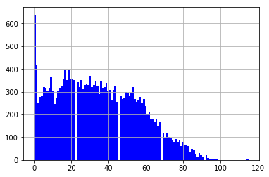
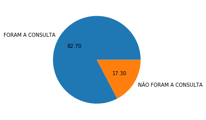
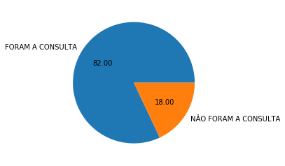
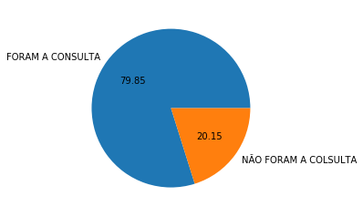

# Investigação de dados

## DataSet: _Não comparecimento as consultas médicas_

Esta base de dados possui informações de 100.000 consultas médicas no Brasil e está focado na questão de buscar compreender se o paciente irá ou não comparecer a consulta. As características sobre os pacientes são descritas em cada linha.

<li>**ScheduledDay:** informa o dia em que o paciente marcou sua consulta.
<li>**Neighborhood:** indica a localização do hospital.
<li>**Scholarship:** indica se o paciente está ou não envolvido com o programa Bolsa Família.
Tenha cuidado ao interpretar a última coluna. **'No'** significa que o paciente compareceu a consulta previamente agendada. Por outro lado, **'Yes'** signifca que ele não compareceu.

## Table of Contents

<ul>
<li><a href="#intro">Introduction</a></li>
<li><a href="#wrangling">Data Wrangling</a></li>
<li><a href="#eda">Exploratory Data Analysis</a></li>
<li><a href="#conclusions">Conclusions</a></li>
</ul>

## Perguntas


```python

```

<li>**1)** Quem mais falta as consultas homens ou mulheres?


```python

```


<li>**2)** Qual a proporção de pacientes que não comparecem às consultas?


```python

```


```python

```

<li>**3)** Qual a distribuição da idade de pacientes que não comparecem às consultas?


```python

```

<li>**4)** Há alguma relação entre doença e não comparecimento às consultas?


<li>**5)** Qual a cidade com maior número de não comparecimentos?


```python

```

<li>**6)** Qual é o mês, dia da semana e dia do mês com maior número de não comparecimentos?


<li>**7)** Há alguma correlação entre a participação no programa social Bolsa Família e os comparecimentos?

## Carregar os dados:


```python
%matplotlib inline
import pandas as pd
df_appointments = pd.read_csv('noshowappointments-kagglev2-may-2016.csv');
df_appointments.head()
```


<div>
<style scoped>
    .dataframe tbody tr th:only-of-type {
        vertical-align: middle;
    }

    .dataframe tbody tr th {
        vertical-align: top;
    }

    .dataframe thead th {
        text-align: right;
    }
</style>
<table border="1" class="dataframe">
  <thead>
    <tr style="text-align: right;">
      <th></th>
      <th>PatientId</th>
      <th>AppointmentID</th>
      <th>Gender</th>
      <th>ScheduledDay</th>
      <th>AppointmentDay</th>
      <th>Age</th>
      <th>Neighbourhood</th>
      <th>Scholarship</th>
      <th>Hipertension</th>
      <th>Diabetes</th>
      <th>Alcoholism</th>
      <th>Handcap</th>
      <th>SMS_received</th>
      <th>No-show</th>
    </tr>
  </thead>
  <tbody>
    <tr>
      <th>0</th>
      <td>2.987250e+13</td>
      <td>5642903</td>
      <td>F</td>
      <td>2016-04-29T18:38:08Z</td>
      <td>2016-04-29T00:00:00Z</td>
      <td>62</td>
      <td>JARDIM DA PENHA</td>
      <td>0</td>
      <td>1</td>
      <td>0</td>
      <td>0</td>
      <td>0</td>
      <td>0</td>
      <td>No</td>
    </tr>
    <tr>
      <th>1</th>
      <td>5.589978e+14</td>
      <td>5642503</td>
      <td>M</td>
      <td>2016-04-29T16:08:27Z</td>
      <td>2016-04-29T00:00:00Z</td>
      <td>56</td>
      <td>JARDIM DA PENHA</td>
      <td>0</td>
      <td>0</td>
      <td>0</td>
      <td>0</td>
      <td>0</td>
      <td>0</td>
      <td>No</td>
    </tr>
    <tr>
      <th>2</th>
      <td>4.262962e+12</td>
      <td>5642549</td>
      <td>F</td>
      <td>2016-04-29T16:19:04Z</td>
      <td>2016-04-29T00:00:00Z</td>
      <td>62</td>
      <td>MATA DA PRAIA</td>
      <td>0</td>
      <td>0</td>
      <td>0</td>
      <td>0</td>
      <td>0</td>
      <td>0</td>
      <td>No</td>
    </tr>
    <tr>
      <th>3</th>
      <td>8.679512e+11</td>
      <td>5642828</td>
      <td>F</td>
      <td>2016-04-29T17:29:31Z</td>
      <td>2016-04-29T00:00:00Z</td>
      <td>8</td>
      <td>PONTAL DE CAMBURI</td>
      <td>0</td>
      <td>0</td>
      <td>0</td>
      <td>0</td>
      <td>0</td>
      <td>0</td>
      <td>No</td>
    </tr>
    <tr>
      <th>4</th>
      <td>8.841186e+12</td>
      <td>5642494</td>
      <td>F</td>
      <td>2016-04-29T16:07:23Z</td>
      <td>2016-04-29T00:00:00Z</td>
      <td>56</td>
      <td>JARDIM DA PENHA</td>
      <td>0</td>
      <td>1</td>
      <td>1</td>
      <td>0</td>
      <td>0</td>
      <td>0</td>
      <td>No</td>
    </tr>
  </tbody>
</table>
</div>


## Respostas:1) Quem mais falta as consultas homens ou mulheres?


```python
 paciente=df_appointments[ df_appointments['No-show'] == 'Yes']

paciente.groupby('Gender')['AppointmentID'].nunique().plot(kind='bar')


```


    <matplotlib.axes._subplots.AxesSubplot at 0x1ae987c62e8>


Com base nos dados fornecidos analisasse que as mulheres faltam mais do que os homens. 14594 mulheres que falraram num total de 71840, mediante a 7725 homens que faltaram num total de 38687.

 

# 2. Qual a proporção de pacientes que não comparecem às consultas? 

Vimos na qustão anterior que o total de consultas marcadas é de 110527 dentre elas 71840 foram marcadas por mulheres e 38687 por homens o numero total de pessoas que faltaram as consultas é de 22319. Uma proporção de 22319/110527 tem como resultado que 20% das consultas foram faltadas. 

# 3.Qual a distribuição da idade de pacientes que não comparecem às consultas?


```python
df_appointments.groupby(['No-show'])['Age'].get_group('Yes').hist(bins=120,alpha=1.0,color='Blue')
```


    <matplotlib.axes._subplots.AxesSubplot at 0x1ae986083c8>





A maior parte das pessoas que não compareceram as consultas foi na faixa etaria entre 0 e 1 ano  E pode ser analisado também que quanto maior a idade menor o número de faltas. 

# **4)** Há alguma relação entre doença e não comparecimento às consultas?


```python
naocomparecimento=distribuicao[(distribuicao['Hipertension'] == 1,(distribuicao['No-show']=='Yes') ) | (distribuicao['Diabetes'] == 1) | (distribuicao['Alcoholism'] == 1) | (distribuicao['Handcap'] == 1) ]
```


```python
df_appointments["Hipertension"].value_counts()
```


    0    88726
    1    21801
    Name: Hipertension, dtype: int64


Primeiramente está sendo mostrado o número de pessoas que contem a doença do total 


```python
df_H = df_appointments.loc[df_appointments['Hipertension'] == 1, ['No-show', 'Hipertension']]
df_H_Yes = df_H.loc[df_H['No-show'] == 'Yes', ['Hipertension']].count()
df_all_rows = pd.concat([df_H_Yes])
df_all_rows.interpolate(method='linear').value_counts()

```


    3772    1
    dtype: int64


Esse número é para identificar o quantidade de pessoas que não foram a consulta das que estão com a doença 


```python
import matplotlib.pyplot as plt
plt.figure("")
values = [18029,3772] 
labels = ['FORAM A CONSULTA', 'NÃO FORAM A CONSULTA'] 
plt.pie(values, labels=labels, autopct='%.2f')
plt.show()

```





```python
df_appointments["Diabetes"].value_counts()
```


    0    102584
    1      7943
    Name: Diabetes, dtype: int64


```python
df_D = df_appointments.loc[df_appointments['Diabetes'] == 1, ['No-show', 'Diabetes']]
df_D_Yes = df_D.loc[df_D['No-show'] == 'Yes', ['Diabetes']].count()
df_all_rows = pd.concat([df_D_Yes])
df_all_rows.interpolate(method='linear').value_counts()

```


    1430    1
    dtype: int64


```python
import matplotlib.pyplot as plt
plt.figure("")
values = [6513,1430] 
labels = ['FORAM A CONSULTA', 'NÂO FORAM A CONSULTA'] 
plt.pie(values, labels=labels, autopct='%.2f')
plt.show()
```





```python
df_appointments["Alcoholism"].value_counts()
```


    0    107167
    1      3360
    Name: Alcoholism, dtype: int64


```python
df_A = df_appointments.loc[df_appointments['Alcoholism'] == 1, ['No-show', 'Alcoholism']]
df_A_Yes = df_A.loc[df_A['No-show'] == 'Yes', ['Alcoholism']].count()
df_all_rows = pd.concat([df_A_Yes])
df_all_rows.interpolate(method='linear').value_counts()
```


    677    1
    dtype: int64


```python
import matplotlib.pyplot as plt
plt.figure("")
values = [2683,677] 
labels = ['FORAM A CONSULTA', 'NÃO FORAM A COLSULTA'] 
plt.pie(values, labels=labels, autopct='%.2f')
plt.show()
```





Diante dos dados extraidos quando é comparado o número de pessoas que falta com o número total de pessoas que tem a doença. Os alcolatras são os que mais faltam, eles faltam 4,9% das consultas marcadas em seguidas os Hipertensos com 4,7% e por ultimos os Diabeticos com 4,5%

# **5)** Qual a cidade com maior número de não comparecimentos?# 


```python
df = df_appointments.loc[df_appointments['No-show'] == 'Yes', ['No-show', 'Neighbourhood']]
df_grouped = df.groupby('Neighbourhood').size().reset_index(name='Cidade com mais faltas')
df_grouped.loc[df_grouped['Cidade com mais faltas'].idxmax()]


```


    Neighbourhood             JARDIM CAMBURI
    Cidade com mais faltas              1465
    Name: 38, dtype: object


A Hospital com mais faltas é do bairro Jardim Camburi que fica na cidade de Vitória, capital do Espirito Santo. 

# **6)** Qual é o mês, dia da semana e dia do mês com maior número de não comparecimentos?


```python

```

# **7)** Há alguma correlação entre a participação no programa social Bolsa Família e os comparecimentos?


```python
df_appointments.groupby(["Scholarship", "No-show"]).size()


```


    Scholarship  No-show
    0            No         79925
                 Yes        19741
    1            No          8283
                 Yes         2578
    dtype: int64


O número de pessoas que não possui o Bolsa familia e faltam as consultas tem um percentual de 20% do total e o percentual de pessoas que possuem o beneficio e faltam as consultas é de 24% do seu total, o fato da pessoa ser beneficiada com o bolsa familia pouco interfere no número de faltas da sua classe.
